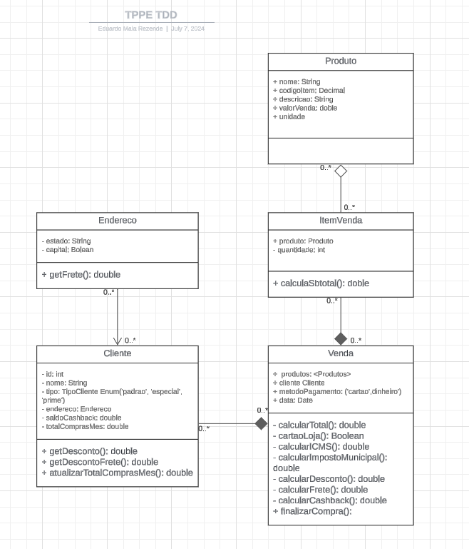

## Trabalho Prático TDD

Trabalho realizado para a disciplina de Técnicas de Programação para Plataformas Emergentes.

### Equipe:

| Estudante | Matrícula | 
|-------------|-------------|
| Eduardo Maia Rezende  | 180119231 |
| José Luís Ramos Teixeira | 190057858 |
| Pedro Vitor Augusto de Jesus | 200073249 |
| Felipe Alef Pereira Rodrigues | 190042532 |

### Descrição do Projeto

O sistema foi desenvolvido utilizando a ferramenta JUnit4 com o objetivo de implementar a técnica de desenvolvimento de software TDD (Test Driven Development) e a técnica de parametrização de testes. A aplicação simula um sistema de vendas, onde é possível gerenciar clientes, produtos e realizar vendas, calculando valores como descontos, impostos e frete.

### Diagrama de Classes

O diagrama de classes a seguir ilustra a estrutura do sistema, incluindo as classes `Cliente`, `Endereco`, `Produto`, `ItemVenda` e `Venda`, bem como seus atributos e métodos principais.

#### Descrição das Classes:

- **Produto**:
  - **Atributos**: `nome`, `codigoItem`, `descricao`, `valorVenda`, `unidade`
  - **Métodos**: -
  
- **Endereco**:
  - **Atributos**: `estado`, `capital`
  - **Métodos**: `getFrete()`

- **Cliente**:
  - **Atributos**: `id`, `nome`, `tipo`, `endereco`, `saldoCashback`, `totalComprasMes`
  - **Métodos**: `getDesconto()`, `getDescontoFrete()`, `atualizarTotalComprasMes()`

- **ItemVenda**:
  - **Atributos**: `produto`, `quantidade`
  - **Métodos**: `calculaSubtotal()`

- **Venda**:
  - **Atributos**: `produtos`, `cliente`, `metodoPagamento`, `data`
  - **Métodos**: `calcularTotal()`, `cartaoLoja()`, `calcularICMS()`, `calcularImpostoMunicipal()`, `calcularDesconto()`, `calcularFrete()`, `calcularCashback()`, `finalizarCompra()`

### Implementação

O desenvolvimento seguiu a abordagem TDD, onde os testes são escritos antes da implementação do código funcional. Cada funcionalidade do sistema foi desenvolvida após a criação dos respectivos testes, garantindo que o código atenda aos requisitos especificados pelos testes.

### Ferramentas Utilizadas

- **JUnit4**: Ferramenta de testes unitários para Java, utilizada para escrever e executar os testes.
- **VScode**: utilizado para o desenvolvimento do projeto.
- **Git/GitHub**: Controle de versão e hospedagem do código-fonte.

### Considerações Finais

Este trabalho prático demonstrou a eficácia da técnica TDD no desenvolvimento de software, garantindo a qualidade e a confiabilidade do código desde as etapas iniciais do desenvolvimento. A parametrização dos testes permitiu uma maior cobertura de casos de teste, tornando o sistema mais robusto e menos suscetível a erros.

---
